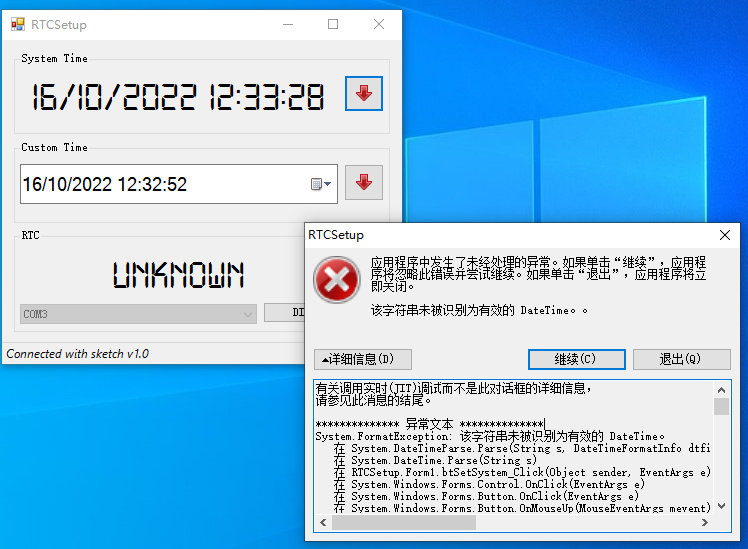

# About

I tried `VisualStudio/RTCSetup/RTCSetup/bin/Debug/RTCSetup.exe`, but it went wrong.



so i write the script with python.


# How to use

1. install python on your os
2. execute `pip install pyserial`
3. save `RTCSetup-main.py` to your disk, run `python RTCSetup-main.py` and input number to choose serial port, then things done.

Test on Win10 and Ubuntu.

```shell
[deffun@ubuntu ~]$ sudo python3 RTCSetup-main.py 
------------------------------------------
0:	/dev/ttyS0
		description: ttyS0
		hardware-id: PNP0501
		serial-number: None
		manufacturer: None
1:	/dev/ttyUSB0
		description: USB Serial
		hardware-id: USB VID:PID=1A86:7523 LOCATION=2-2.1
		serial-number: None
		manufacturer: None
------------------------------------------
input integer to choose serial port
your choice: 1
datetime now: 2022-10-16 12:50:54.352920
resp: b'OK\r\n'
resp: b'16/10/2022 12:50:54\r\n'

```

```shell
 G:\PY_PROJ\RTCSetup\Python>python RTCSetup-main.py
------------------------------------------
0:      COM1
                description: 通信端口 (COM1)
                hardware-id: ACPI\PNP0501\0
                serial-number: None
                manufacturer: (标准端口类型)
1:      COM4
                description: USB-SERIAL CH340 (COM4)
                hardware-id: USB VID:PID=1A86:7523 SER= LOCATION=1-7
                serial-number:
                manufacturer: wch.cn
------------------------------------------
input integer to choose serial port
your choice: 1
datetime now: 2022-10-16 12:56:53.341106
resp: b'OK\r\n'
resp: b'16/10/2022 12:56:53\r\n'

```
